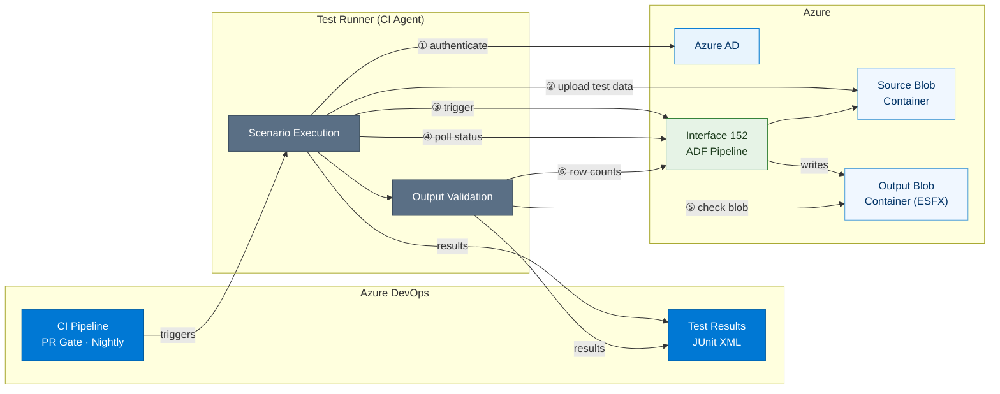

# Architecture Diagram — Interface 152 Performance Test Suite

---

## Component Legend

| Colour | Component |
|---|---|
| Blue | Azure DevOps CI/CD |
| Grey | Test runner scenarios and validation |
| Light blue | Azure AD authentication |
| Sky | Azure Blob Storage (source + output) |
| Green | Azure Data Factory — Interface 152 |

## Flow Summary

| Step | Action | Assertion |
|---|---|---|
| ① | Service principal authenticates for two scopes (management + storage) | Token endpoint returns 200 |
| ② | Test runner uploads synthetic payload to source container | Blob Storage returns 201 |
| ③ | Test runner triggers Interface 152 ADF pipeline | ADF returns runId (200) |
| ④ | Test runner polls pipeline status every 10 s (max 10 min) | Terminal state reached |
| ⑤ | Output container checked for blobs written after trigger time | Blob exists, size > 0, name matches pattern |
| ⑥ | ADF activity runs queried for record counts | rowsRead > 0, rowsWritten > 0, written ≤ read |
