# Architecture Diagram — Interface 152 Performance Test Suite

```mermaid
flowchart TD
    %% ── Styles ───────────────────────────────────────────────────────────────
    classDef ado      fill:#0078d4,color:#fff,stroke:#005a9e
    classDef k6node   fill:#7d64ff,color:#fff,stroke:#5a48cc
    classDef azure    fill:#e8f4fd,color:#003366,stroke:#0078d4
    classDef storage  fill:#f0f7ff,color:#003366,stroke:#50a0d8
    classDef adfnode  fill:#e6f3e6,color:#1a3a1a,stroke:#2e7d32
    classDef vernode  fill:#fff3e0,color:#3e2000,stroke:#f57c00
    classDef result   fill:#e8f5e9,color:#1b5e20,stroke:#43a047

    %% ── Azure DevOps ─────────────────────────────────────────────────────────
    subgraph CI["Azure DevOps"]
        gate["PR Gate\n──────────────\nperf-gate.yml\ntrigger: PR → main\nfailTaskOnFailedTests: true"]
        nightly["Nightly Schedule\n──────────────\nperf-nightly.yml\ncron: 0 2 · · ·\nvisibility only"]
        junit["PublishTestResults\n──────────────\nresults/summary.xml\nJUnit XML"]
    end

    %% ── k6 Scenarios ─────────────────────────────────────────────────────────
    subgraph K6["k6 Test Runner (Agent)"]
        load["load.js\n──────────────\n5 VUs · 5 minutes\nPR gate scenario\n100 records / iter"]
        smoke["smoke.js\n──────────────\n1 VU · 1 iteration\nNightly canary\n10 records / iter"]
    end

    %% ── Azure Services ───────────────────────────────────────────────────────
    subgraph AZURE["Azure"]

        aad["Azure Active Directory\n──────────────\nOAuth2 client_credentials\nScope 1: management.azure.com\nScope 2: storage.azure.com"]

        subgraph SRC["Blob Storage — Source"]
            srcblob["TMH Source Container\n──────────────\nload-{timestamp}-{VU}.json\nsmoke-{timestamp}.json\nBlockBlob · application/json"]
        end

        subgraph ADF["Azure Data Factory — Interface 152"]
            pipeline["Pipeline Run\n──────────────\nTransform + Filter\nREST API v2018-06-01\ncreateRun → runId"]
            poll["Status Polling\n──────────────\nGET pipelineruns/{runId}\nevery 10 s · max 10 min\nSucceeded · Failed · Cancelled"]
            activity["Activity Runs API\n──────────────\nPOST queryActivityruns\nrowsRead · rowsWritten"]
        end

        subgraph OUT["Blob Storage — Output (ESFX)"]
            outblob["Output Container\n──────────────\n{timestamp}.csv.esfx\nEncrypted CSV\nContent-Length > 0"]
        end

    end

    %% ── Verification Layer ───────────────────────────────────────────────────
    subgraph VERIFY["Output Validation (verify.js)"]
        blobcheck["Blob Check\n──────────────\n· Blob exists after trigger time\n· Name matches pattern\n· File size > 0"]
        countcheck["Count Reconciliation\n──────────────\n· rows read > 0\n· rows written > 0\n· rows written ≤ rows read"]
    end

    %% ── CI triggers ──────────────────────────────────────────────────────────
    gate    -->|"triggers\nload.js"| load
    nightly -->|"triggers\nsmoke.js"| smoke

    %% ── Step 1: Authenticate ─────────────────────────────────────────────────
    load  -->|"① Authenticate\nclient_credentials grant"| aad
    smoke -->|"① Authenticate\nclient_credentials grant"| aad
    aad   -->|"mgmt token\nstorage token"| load
    aad   -->|"mgmt token\nstorage token"| smoke

    %% ── Step 2: Upload payload ───────────────────────────────────────────────
    load  -->|"② Upload synthetic payload\nHTTP PUT · BlockBlob"| srcblob
    smoke -->|"② Upload synthetic payload\nHTTP PUT · BlockBlob"| srcblob

    %% ── Step 3 & 4: Trigger + Poll ───────────────────────────────────────────
    load  -->|"③ Trigger\nPOST createRun"| pipeline
    smoke -->|"③ Trigger\nPOST createRun"| pipeline
    pipeline --> poll
    load  -->|"④ Poll every 10s"| poll
    smoke -->|"④ Poll every 10s"| poll

    %% ── ADF internal flow ────────────────────────────────────────────────────
    pipeline -->|"reads source data"| srcblob
    pipeline -->|"writes encrypted output"| outblob

    %% ── Step 5 & 6: Verify ───────────────────────────────────────────────────
    load  -->|"⑤⑥ on Succeeded"| VERIFY
    smoke -->|"⑤⑥ on Succeeded"| VERIFY
    blobcheck  -->|"GET list blobs"| outblob
    countcheck -->|"POST queryActivityruns"| activity

    %% ── Results ──────────────────────────────────────────────────────────────
    load  -->|"JUnit XML\n+ threshold metrics"| junit
    smoke -->|"JUnit XML\n+ threshold metrics"| junit

    %% ── Apply styles ─────────────────────────────────────────────────────────
    class gate,nightly,junit ado
    class load,smoke k6node
    class aad azure
    class srcblob,outblob storage
    class pipeline,poll,activity adfnode
    class blobcheck,countcheck vernode
```

---

## Component Legend

| Colour | Component |
|---|---|
| Blue | Azure DevOps CI/CD |
| Purple | k6 test scenarios |
| Light blue | Azure AD / auth |
| Sky | Azure Blob Storage (source + output) |
| Green | Azure Data Factory — Interface 152 |
| Amber | Output validation layer |

## Flow Summary

| Step | Action | Assertion |
|---|---|---|
| ① | SP authenticates for two scopes (management + storage) | Token endpoint returns 200 |
| ② | k6 uploads synthetic payload to source container | Blob Storage returns 201 |
| ③ | k6 triggers Interface 152 ADF pipeline | ADF returns runId (200) |
| ④ | k6 polls pipeline status every 10 s (max 10 min) | Terminal state reached |
| ⑤ | k6 lists output container for blobs after trigger time | Blob exists, size > 0, name matches pattern |
| ⑥ | k6 queries ADF activity runs for record counts | rowsRead > 0, rowsWritten > 0, written ≤ read |
